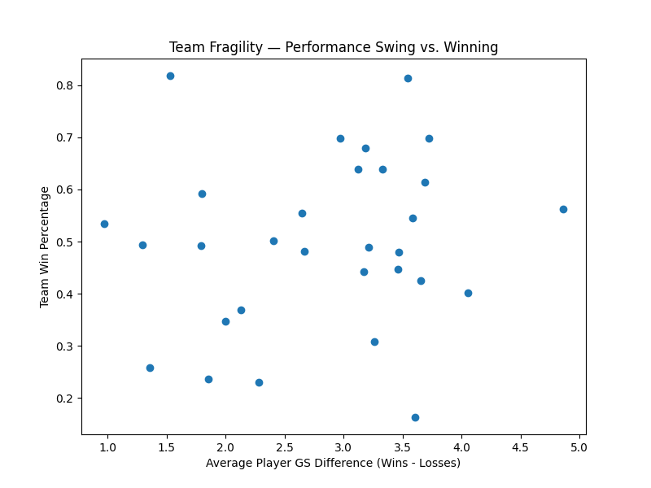
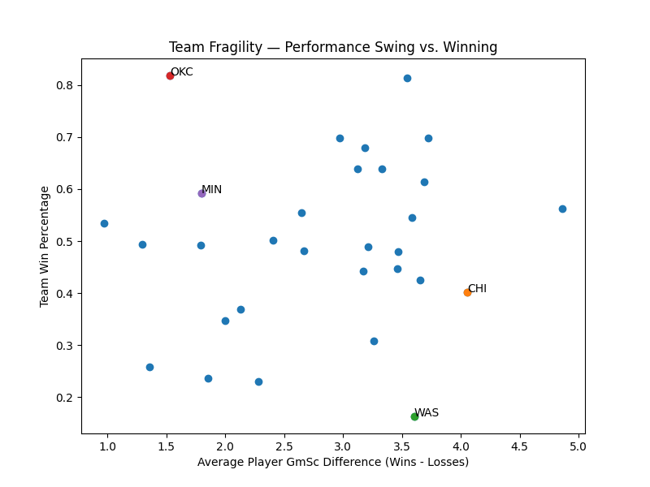
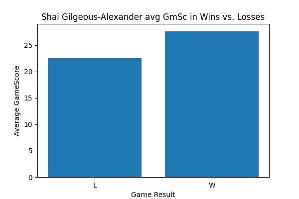

# Team Fragility and Winning in the NBA
## League-wide patterns in player performance
- Across the league, there is a loose relationship between average player performance swings, between wins and losses, and win percentage. This suggests that team success does not rely on standout performances alone, but how reliably production gets distributed. For example, a team may rely on several "role players" to outperform their average on a given night rather than one "star player" carrying the load. This means that when one or two players fall back to their baseline or worse, the overall performance takes a sharp dip, leading to inconsistenet results. In contrast, teams with more stable production from a star player can absorb off nights from role players without seeing the same swing in outcomes.

## What "fragility" looks like at the team level
- At the team level, fragility appears when a team shows larger player performance difference swings, but does not convert those swings into consistent wins. On the scatter plot, these teams appear on the far right, towards the bottom. This suggests that strong individual nights matter less when they are not anchored by a reliable top-end star player. As a result, outcomes become more inconsistent, depending on multiple players to play well at the same time.
## The Chicago Bulls as a fragile team
- One unexpected result of my approach is that it produces a win percentage that differs from the Bulls' official record. Chicago's record, 39-43, should have a win % of around 48. But, the player-level analysis computes a win rate closer to 40%.
- That gap is meaningful. Rather than counting games equally, the analysis reflects what a typical night looks like for the roster as a whole. 
- This discrepancy suggests that Chicago's actual record outperformed what their player-level performance consistently supported — rather than functioning as a prediction, the results highlight a baseline produced by player performance, emphasizing the idea of fragility. When wins depend on several players exceeding their baseline at the same time, success becomes harder to sustain night to night.
## Comparing Chicago to stable contenders

- Highlighted above are 4 types of teams; The Washington Wizards, a struggling fragile team; The Chicago Bulls, a Middle of the pack yet fragile team; The Minneosota Timberwolves, a good steady team; and the Oklahoma City Thunder, an elite strong team. 

- When comparing Chicago to a stable contender like the Oklahoma City Thunder, it becomes clear why consistency matters. The Thunder can rely on steady production from the MVP of the league Shai Gilgeous-Alexander. Shai, in wins or losses, boasts an average gamescore above 20, meaning that if another player has an off night, Shai can keep the ship afloat.

- Chicago on the other hand does not have that margin for error. Wins depend on several players exceeding their baseline at the same time. when one or two fall back to average or below average, results swing quickly, leading to inconsistency over the course of an 82 game season.
## What this suggests for the Bulls going forward
- The Bulls find themselves in a position where they need to acquire a "star" player. Someone who can sustain the blow of off-nights from role players.
- Now these stats are from last season, and Chicago is off to a better start this year with acquisitions like Josh Giddey, Tre jones, Kevin Huerter, Isaac Okoro, and Zach Collins. The key missing piece however, remains. They need a star.
- With Giannis Antetekounmpo reportedly wanting out of Milwaukee, The Bulls should have one thing in mind. Do whatever it takes to trade for him. Adding a true top-end scorer would shift Chicago away from fragility and towrad true stability.
## Conclusion
- This analysis suggestst that winning depends less on peak performances and more on how reliably production is sustained. Teams without a consistent top-end scorer have wider swings in outcomes. Fragility helps explain why those swings persist over a full season